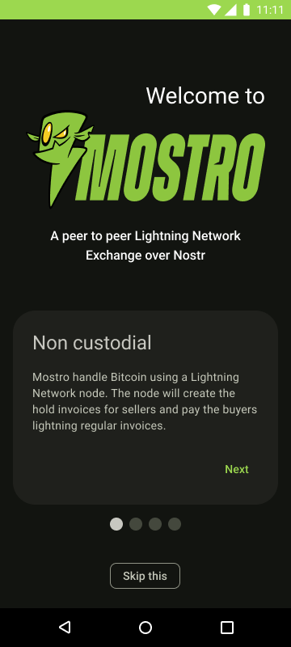

# Mostro mobile app design proposal

## Android

### Onboarding screens

### Market main sell screen

### Here you can see a first Market Sell prototype flow:

[Flow without Onboarding](https://www.figma.com/proto/KEMkxJIirtViHKG4opCXLz/Dark-Mostro?page-id=0%3A1&type=design&node-id=56-2771&viewport=-267%2C732%2C0.28&t=6MRG9YkA1kU9IT4W-1&scaling=scale-down&starting-point-node-id=56%3A2771&show-proto-sidebar=1&mode=design)

[Flow with onboarding an PIN set (930257)](https://www.figma.com/proto/KEMkxJIirtViHKG4opCXLz/Dark-Mostro?page-id=0%3A1&type=design&node-id=1-2&viewport=-1648%2C768%2C0.41&t=bF1FvUnT4ZIRiQTS-1&scaling=scale-down&starting-point-node-id=1%3A2&show-proto-sidebar=1&mode=design)
